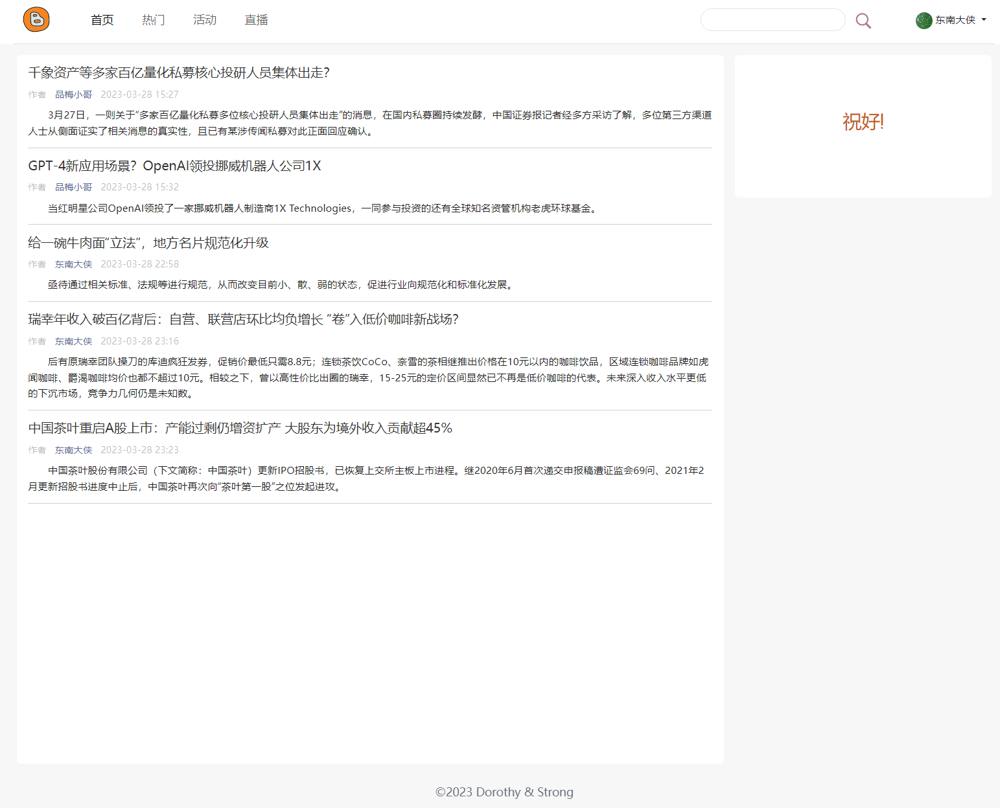
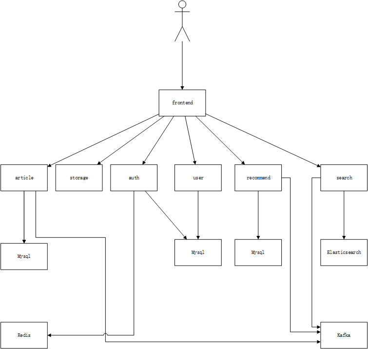

# tinyblog-go

## 介绍

这不是一个严肃的项目，功能不完善，更不可能应用于生产环境。这只是个人的学习、思考，这是一片试验田。

**严重参考了 [microservices-demo](https://github.com/GoogleCloudPlatform/microservices-demo)。**

## 界面

| 首页                                                                                                              | 文章详情页                                                                                                          |
| ----------------------------------------------------------------------------------------------------------------------- | ------------------------------------------------------------------------------------------------------------------------ |
|  | 

## 架构

| 服务                                              | 说明                                                                                                                       |
| ---------------------------------------------------- | --------------------------------------------------------------------------------------------------------------------------------- |
| [frontend](./src/frontend)                           | 提供HTTP服务，支持终端用户的交互操作。 |
| [auth/user](./src/user)                              | 用户及鉴权服务。处理用户的CRUD及鉴权服务。鉴权支持两种方式：基于session、基于JWT。这俩服务实现在了一起，共用一个数据库。目前，会话数据存放在Redis中；用户数据存放在Mysql中。用户数据的修改（创建、修改昵称等），会生成相应的事件，发送到Kafka。 |
| [article](./src/article)                             | 文章服务。处理文章的CRUD。对文章的修改操作，会生成相应的事件，发送到Kafka。|
| [recommend](./src/recommend)                         | 推荐服务。生成首页推荐及针对特定文章的推荐。目前，这是个假推荐，从数据库中随机取几个。通过Kafka接收用户、文章事件，进行相应处理。|
| [search](./src/search)                               | 搜索服务。目前，支持对文章标题、文章内容的简单搜索。通过Kafka接收用户、文章事件，进行索引等处理。|
| [storage](./src/storage)                             | 存储服务。存储用户上传的文件，尚未实现。|
| [admin](./src/admin)                                 | 管理后台，尚未实现。|

## 代码结构

以[frontend](./src/frontend)服务为例。

| 目录                                              | 说明                                                                                                                       |
| ---------------------------------------------------- | --------------------------------------------------------------------------------------------------------------------------------- |
| [interfaces](./src/frontend/interfaces)             | 定义构成应用的各个组件的接口。[interfaces.Context](./src/frontend/interfaces/context.go)，可视作其余组件的容器。 |
| [app](./src/frontend/app)                           | 构建应用的各个组件。[app.context_impl.ContextImpl](./src/frontend/app/context_impl.go)是对[interfaces.Context](./src/frontend/interfaces/context.go)的实现。 |
| [genproto](./src/frontend/genproto)                 | 存放用protoc文件生成的各个文件。proto文件放在[pb](./pb)目录下。 |
| [common](./src/frontend/common)                     | 存放各个应用组件可能公用的代码。 |
| [service](./src/frontend/common)                    | 应用依赖的各个服务。对frontend来说，就是需要作为客户端使用的各个gRPC服务。|
| [static](./src/frontend/static)                     | web服务用到的各个静态资源，js、css、html等。 |
| [templates](./src/frontend/templates)               | 用来生成页面的templates。 |
| [web](./src/frontend/web)                           | web服务的实现。 |
| [webfrontend](./src/frontend/webfrontend)           | 前端代码。计划是用来生成static下的js、css等静态资源。这部分没有组织良好，也就是能凑合用。 |
| [main](./src/frontend/main.go)                      | main函数所在，执行的入口。 |
| [Makefile](./src/frontend/Makefile)                 | 方便执行重复执行的命令。 |
| [Dockerfile](./src/frontend/Dockerfile)             | 用来生成Docker image。 |

## 微服务间通信

- 需要同步执行的，使用gRPC来实现。
- 需要异步执行的，使用Kafka来实现。

## 主要依赖

- [Fiber](https://gofiber.io/)，用来实现HTTP服务。
- [gRPC](https://grpc.io/)，用来实现gRPC服务。
- [gorm](https://gorm.io/)，用来操作数据库。
- [kafka-go](https://github.com/segmentio/kafka-go)，用来与Kafka交互。
- [go-elasticsearch](https://github.com/elastic/go-elasticsearch)，用来与Elasticsearch交互。
- [bluemonday](https://github.com/microcosm-cc/bluemonday)，用来处理用户生成的内容（如：文章等）。
- [TinyMCE](https://www.tiny.cloud)，给用户用的WYSIWYG编辑器。
- [Prism](https://prismjs.com)，用来高亮显示文章中的代码片段。
- [Bootstrap](https://getbootstrap.com)，前端页面部分用到。
- [jQuery](https://jquery.com)，前端页面用到了一点。

## 问题

- 未完全实现微服务架构中的诸多常见模式。
- 首次ROP，估计也是MTFBWY。
