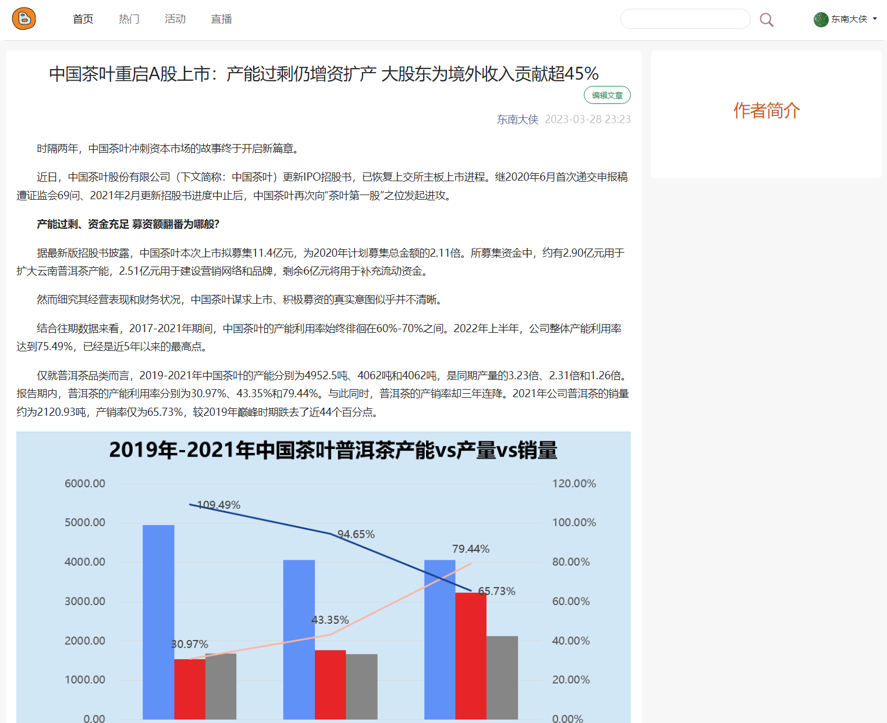

# tinyblog-go

## 介绍

这不是一个严肃的项目，功能谈不上完善，更不可能应用于生产环境。这只是个人的学习、思考，这是一片试验田。

**严重参考了 [microservices-demo](https://github.com/GoogleCloudPlatform/microservices-demo)。**

## 界面

| 首页                                                                                                              | 文章详情页                                                                                                          |
| ----------------------------------------------------------------------------------------------------------------------- | ------------------------------------------------------------------------------------------------------------------------ |
|  | 

## 架构

| 服务                                              | 说明                                                                                                                       |
| ---------------------------------------------------- | --------------------------------------------------------------------------------------------------------------------------------- |
| [frontend](./src/frontend)                           | 提供HTTP服务，支持终端用户的交互操作。 |
| [auth/user](./src/user)                              | 用户及鉴权服务。处理用户的CRUD及鉴权服务。鉴权支持两种方式：基于session、基于JWT。这俩服务实现在了一起，共用一个数据库。目前，会话数据存放在Redis中；用户数据存放在Mysql中。用户数据的修改（创建、修改昵称等），会生成相应的事件，发送到Kafka。 |
| [article](./src/article)                             | 文章服务。处理文章的CRUD。对文章的修改操作，会生成相应的事件，发送到Kafka。|
| [recommend](./src/recommend)                         | 推荐服务。生成首页推荐及针对特定文章的推荐。目前，这是个假推荐，从数据库中随机取几个。通过Kafka接收用户、文章事件，进行相应处理。|
| [search](./src/search)                               | 搜索服务。目前，支持对文章标题、文章内容的简单搜索。通过Kafka接收用户、文章事件，进行索引等处理。|
| [storage](./src/storage)                               | 搜索服务。目前，支持对文章标题、文章内容的简单搜索。通过Kafka接收用户、文章事件，进行索引等处理。|

## 问题

- 未完全实现微服务架构中的诸多常见模式。
- 
